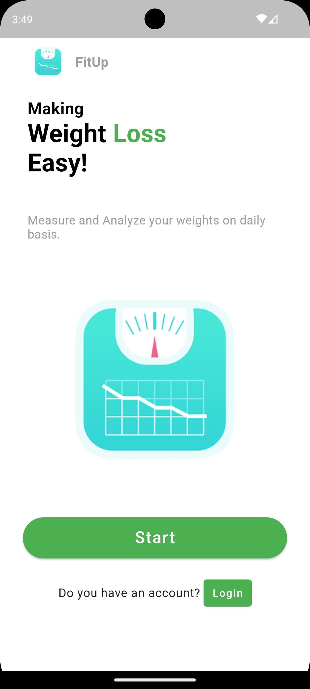
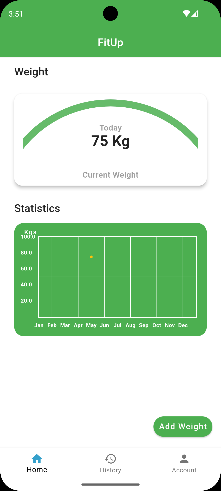

<p align="center">
  
</p>

# FitUp

FitUp is a mobile application built using flutter and firebase both for android and iOS platforms.

- Track your daily weight progress
- Check out stats and remain updated

## Features

- User Login/Signup
- Weight Tracking , Editing and Deleting from firestore
- Uses Providers Inside GetIt to effectively manage state of app
- Design is responsive to different screen sizes
- Cool EyeCatching UI/UX
- Beginner Friendly and Optimised Code

## Screenshots

<table>
<thead>
  <tr>
    <th>Splash Screen</th>
    <th>Welcome Screen</th>
    <th>Login/Signup</th>
  </tr>
</thead>
<tbody>
  <tr>
    <td></td>
    <td></td>
   <td></td>
    
    
  </tr>
</tbody>
 <thead>
  <tr>
    <th>Home Screen</th>
    <th>History Screen</th>
    <th>User Profile</th>
  </tr>
</thead>
 <tbody>
  <tr>
   <td></td>
     <td></td>
    <td></td>
  </tr>
</tbody>
</table>

## ER Diagram

<p align="center">
  
</p>

## Run Locally

Clone the project

```bash
  git clone https://github.com/vibhudawar/fitness-app
```

Go to the project directory

```bash
  cd fitness_app
```

Install dependencies

```bash
  flutter pub get
```

Start the app

```bash
  flutter pub run
```

## Tech Stack

**Client:** Flutter

**Server:** Firebase

## Packages

FitUp is currently extended with the following packages. You can find them on pub.dev.

- cupertino_icons: ^1.0.6
- cloud_firestore: ^4.17.3
- firebase_core: ^2.31.0
- firebase_auth: ^4.19.5
- image_picker: ^1.1.1
- firebase_storage: ^11.7.5
- flex_color_scheme: ^7.3.1
- flutter_native_splash: ^2.4.0
- get_it: ^7.7.0
- intl: ^0.19.0
- provider: ^6.1.2
- fl_chart: ^0.67.0
- fluttertoast: ^8.2.5
- babstrap_settings_screen: ^0.1.6
- smooth_page_indicator: ^1.1.0
- percent_indicator: ^4.2.3

## License

[MIT](https://choosealicense.com/licenses/mit/)
